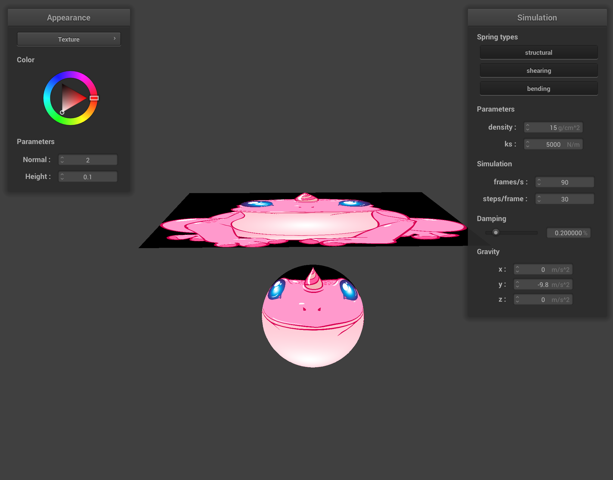

# 
CS 284: Computer Graphics and Imaging, Spring 2019

## 
Project 4: Cloth Simulator

## 
Fan Zhang

### 
Overview

In this project I implemented the cloth simulator based on physical simulation and shader with GLSL program. The fundamental of cloth is mass and spring system. With Hook's law and Netwon's Law, we can simulate the physical properties of masses and springs. The following parts went through the movement and collisions with spheres/planes and the cloth itself. For the shader part, based on GLSL programming, we implemented several different shading types.

This project was really interesting since we can ovserve the physical movement of the cloth and made the simulation more and more realistic. 

### 
Part 1: Masses and springs

#### 1. Implementation Details

In this part, I built the mass and spring system for cloth simulation. The basic idea was to create point masses first at specific positions and then connect mass pairs with different constraints. The implementation is straightforward which looped all the points and assign point masses and springs. One thing to be noticed is to de edge detection when setting the springs since some positions are out of the range.

#### 2. Result from different viewpoints

  <table style="width=100%">
    <tr>
      <td>
      	<td align="middle">
        
        <figcaption align="middle">Pinned2.json: with default viewpoint</figcaption>
      </td>
      <td>
      	<td align="middle">
        
        <figcaption align="middle">Pinned2.json: with another viewpoint</figcaption>
      </td>
    </tr>
  </table>

#### 3. Result with constraints

  <table style="width=100%">
    <tr>
      <td>
      	<td align="middle">
        
        <figcaption align="middle">Pinned2.json: without any shearing constraints</figcaption>
      </td>
      <td>
      	<td align="middle">
        
        <figcaption align="middle">Pinned2.json: with only shearing constraints</figcaption>
      </td>
    </tr>
    <tr>
      <td>
      	<td align="middle">
        
        <figcaption align="middle">Pinned2.json: with all constraints</figcaption>
      </td>
    </tr>
  </table>

### 
Part 2: Simulation via numerical integration

#### 1. Implementation Details

In this part, I applied the force to each point mass and then calculated the updated force. Following the instructions, I first used the `external_accelerations` to each point mass uniformly to calculate the force with **Newton's law**. Second, calculate the force applied by springs with **Hook's law**. Be careful of directions of forces for two point masses connected to one spring. 

After calculating the force, using the **Verlet integration** to compute new point mass positions and implementing an additional check to see whether the length of spring is 10% greater than its `rest_length`. If exceeded, recalculate the position of point masses.

#### 2. Result

##### 2.1 Effects of changing the spring constant ks

  <table style="width=100%">
    <tr>
      <td>
      	<td align="middle">
        
        <figcaption align="middle">Pinned2.json: ks = 10</figcaption>
      </td>
      <td>
      	<td align="middle">
        
        <figcaption align="middle">Pinned2.json: ks = 1000</figcaption>
      </td>
    </tr>
    <tr>
      <td>
      	<td align="middle">
        
        <figcaption align="middle">Pinned2.json: ks = 8000</figcaption>
      </td>
      <td>
      	<td align="middle">
        
        <figcaption align="middle">Pinned2.json: ks = 100000</figcaption>
      </td>
    </tr>
  </table>

I cut out the final status of cloth with different spring constant `ks`. From the result we can see that for a smaller `ks`, the cloth is more stretched since the internal forces with springs are lower so there are some drapes in the cloth. When the `ks` increased, the cloth became more tightened and the effect of drooping between two pinned point masses is weakened. In the last image when the `ks = 100000`, the cloth is almost a square without the effect of gravity. 

##### 2.2 Effects of changing the density

  <table style="width=100%">
    <tr>
      <td>
      	<td align="middle">
        
        <figcaption align="middle">Pinned2.json: density = 1g/cm2</figcaption>
      </td>
      <td>
      	<td align="middle">
        
        <figcaption align="middle">Pinned2.json: density = 5g/cm2</figcaption>
      </td>
    </tr>
    <tr>
      <td>
      	<td align="middle">
        
        <figcaption align="middle">Pinned2.json: density = 15g/cm2</figcaption>
      </td>
      <td>
      	<td align="middle">
        
        <figcaption align="middle">Pinned2.json: density = 50g/cm2</figcaption>
      </td>
    </tr>
  </table>

I cut out the final status of cloth with different density of point masses. Since the density is used to calculate the mass, so a smaller density corresponds to a lighter point mass. From the result when the density is low at 10, the effect of droop for the first row of point masses is not apparent. But when the density increased, the effect became more and more apparent. 

##### 2.3 Effects of changing the damping

  <table style="width=100%">
    <tr>
      <td>
      	<td align="middle">
        
        <figcaption align="middle">Pinned2.json: damping = 0.01</figcaption>
      </td>
      <td>
      	<td align="middle">
        
        <figcaption align="middle">Pinned2.json: damping = 0.2</figcaption>
      </td>
    </tr>
    <tr>
      <td>
      	<td align="middle">
        
        <figcaption align="middle">Pinned2.json: damping = 0.7</figcaption>
      </td>
      <td>
      	<td align="middle">
        
        <figcaption align="middle">Pinned2.json: damping = 1.0</figcaption>
      </td>
    </tr>
  </table>

The `damping` is used when I computed the positions of new point masses to simulate loss of energy due to friction, heat loss, etc. When the value is low, such as 0.01, from the first image we can see since the loss of energy is low so it is hard for the cloth to stop wobbling. The speed of the cloth was also fast that there were many drapes on the cloth. When the value went up, the movement of the cloth became much lower and it took little time to settle down. From the last image when the value is high, the cloth moved very slow and there is fewer drapes.

##### 2.3 Result of pinned4.json

Then result of pinned4.json

### 
Part 3: Handling collisions with other objects

#### 1. Implementation Details

Here I implemented the collide function with spheres and planes. The overall ideas are the same. We assume that in an update that the point mass moves into the sphere or cross the plane, then we use the current position to calculate the tangent point. The tangent point is used to calculate the correction vector starts from the point mass's last position to update the new position when colliding with spheres or planes. 

#### 2. Result

##### 2.1 Sphere collision with different ks

  <table style="width=100%">
    <tr>
      <td>
      	<td align="middle">
        
        <figcaption align="middle">Sphere.json: ks = 500</figcaption>
      </td>
      <td>
      	<td align="middle">
        
        <figcaption align="middle">Sphere.json: ks = 5000</figcaption>
      </td>
    </tr>
    <tr>
      <td>
      	<td align="middle">
        
        <figcaption align="middle">Sphere.json: ks = 50000</figcaption>
      </td>
    </tr>
  </table>

A larger ks corresponds to a larger force with spring. From the above images, when the ks is low, the forces were weak so the cloth drooped around the sphere. When the ks increased, the internal forces with springs became stronger so the shape of cloth became more patulous.

##### 2.2 Plane collision

Cloth lying peacefully at rest on the plane with texture

### 
Part 4: Handling self-collisions

#### 1. Implementation Detail

In this part, I implemented the self collisions of cloth. Since looping all the pair of masses requires a lot of time we partition the area into 3D boxes. First, we used a hash map to store point masses in the same box, and we only considered point masses within a 3D box to collide with each other. After we build this hash map, we can loop all the point masses and force them to stay away from another in the same 3D box with a certain distance.

The hash function that I used to calculate the hash value is :

$box_x * 379 + box_y * 379^2 + box_z * 379^3$

#### 2. Self-collision

  <table style="width=100%">
    <tr>
      <td>
      	<td align="middle">
        
        <figcaption align="middle">SelfCollision: State 1</figcaption>
      </td>
      <td>
      	<td align="middle">
        
        <figcaption align="middle">SelfCollision: State 2</figcaption>
      </td>
    </tr>
    <tr>
      <td>
      	<td align="middle">
        
        <figcaption align="middle">SelfCollision: State 3</figcaption>
      </td>
      <td>
      	<td align="middle">
       	
        <figcaption align="middle">SelfCollision: Final State</figcaption>
      </td>
    </tr>
  </table>

#### 3. Changing density

  <table style="width=100%">
    <tr>
      <td>
      	<td align="middle">
        
        <figcaption align="middle">SelfCollision: density = 0.5</figcaption>
      </td>
      <td>
      	<td align="middle">
        
        <figcaption align="middle">SelfCollision: density = 1</figcaption>
      </td>
    </tr>
    <tr>
      <td>
      	<td align="middle">
        
        <figcaption align="middle">SelfCollision: density = 50</figcaption>
      </td>
      <td>
      	<td align="middle">
        
        <figcaption align="middle">SelfCollision: density = 1500</figcaption>
      </td>
    </tr>
  </table>

Increase density means increase the mass of each point mass. From the result, when the density was large, the cloth became more spread since the force of gravity is obvious. When the density is small, the cloth will still fold itself. 

#### 4. Changing ks

  <table style="width=100%">
    <tr>
      <td>
      	<td align="middle">
        
        <figcaption align="middle">SelfCollision: ks = 10</figcaption>
      </td>
      <td>
      	<td align="middle">
        
        <figcaption align="middle">SelfCollision: ks = 1000</figcaption>
      </td>
    </tr>
    <tr>
      <td>
      	<td align="middle">
        
        <figcaption align="middle">SelfCollision: ks = 10000</figcaption>
      </td>
      <td>
      	<td align="middle">
        
        <figcaption align="middle">SelfCollision: ks = 100000</figcaption>
      </td>
    </tr>
  </table>

Larger ks means larger spring forces to point masses. From the result we can see that larger ks made the cloth more spread because the force of springs would drive the cloth to move in addition to self collision. Something interesting is when the ks is pretty small (10), the cloth was not stable because here the forces of springs were weak so the cloth cann't find a balanced point.

### 
Part 5: Shaders

#### 1. Shader Program

A shader program is a type of computer program used to ask the graphics unit to calculate the shading effect (material, light) during the rendering process. It is isolated programs that run in parallel on GPU. The shader program takes the vertex data as input and uses texture or specific processing methods (diffuse, specular, etc.) to generate a particular material to output. 

**Vertex shader**: The vertex shader is a shader stage in the rasterization pipeline which handles the processing of individual vertices. A vertex shader takes vertex data as input with per-vertex properties. The vertex shader maps a vertex to another vertex by performing transformations to the vertex to transform the vertex from object coordinates to screen coordinates.

**Fragment shaders**: During the rasterization pipeline, after a primitive is rasterized, we get a bunch of samples (fragments).  For each fragment, we calculate the lighting effect or texture mapping to represent its effects such as colors. After the fragment shader stage, rach fragment is shaded with specific effect for display. 

#### 2.  Blinn-Phong shading model

Blinn–Phong shading model consists of three fundamental shading effect: Ambient lighting, Diffuse reflection, and Specular highlights. It is based on perceptual observations instead of physical based calculations (*Path Tracing*). The ambient shading is the independent shading with a constant value to every pixel. The diffuse shading is the effect of light which reflects uniformly in all directions. The specular shading is based on mirror reflection that the effect of shading is stronger in the direction of mirror reflection. After combining all these three shadings, the Blinn-Phing shading can represent the lighting effect during the rendering process.

##### Result

All of the following results were rendered with:

| $k_a$ | $k_d$ | $k_s$ | $I_a$     | $p$  | $Normal$ | $Height$ |
| ----- | ----- | ----- | --------- | ---- | -------- | -------- |
| 0.1   | 0.5   | 1.0   | (1, 1, 1) | 64   | 100      | 0.02     |

  <table style="width=100%">
    <tr>
      <td>
      	<td align="middle">
        
        <figcaption align="middle">Blinn-Phong shading with only ambient component</figcaption>
      </td>
      <td>
      	<td align="middle">
        
        <figcaption align="middle">Blinn-Phong shading with only diffuse component</figcaption>
      </td>
    </tr>
    <tr>
      <td>
      	<td align="middle">
        
        <figcaption align="middle">Blinn-Phong shading with only specular component</figcaption>
      </td>
      <td>
      	<td align="middle">
        
        <figcaption align="middle">Blinn-Phong shading with all components</figcaption>
      </td>
    </tr>
  </table>

#### 3.  Texture Mapping shading model

  <table style="width=100%">
    <tr>
      <td>
      	<td align="middle">
        
        <figcaption align="middle">Texture mapping shading start status</figcaption>
      </td>
      <td>
      	<td align="middle">
        
        <figcaption align="middle">Texture mapping shading final status</figcaption>
      </td>
    </tr>
  </table>

#### 4. Bump and Displacement Mapping shading model

| $Normal $ | $Height $ |
| --------- | --------- |
| 10        | 0.2       |

##### 4.1 Bump Mapping

  <table style="width=100%">
    <tr>
      <td>
      	<td align="middle">
        
        <figcaption align="middle">Bump mapping shading: Sphere, normal = 10, height = 0.2</figcaption>
      </td>
      <td>
      	<td align="middle">
        
        <figcaption align="middle">Bump mapping shading: Cloth, normal = 10, height = 0.2</figcaption>
      </td>
    </tr>
  </table>

##### 4.2 Displacement Mapping

Displacement mapping shading: Sphere, normal = 10, height = 0.2

**Differences between bump mapping and displacement mapping**

Bump mapping only changes the fragment shader to change the normal vector of the fragment. So from the result, we can see that the height can be mapped to display with an illusion of details. However, the displacement mapping also changes the vertex shader with the position of an object. By modifying the position of the vertices, the height is more visible and realistic.  Comparing two spheres, the sphere with bump mapping remains its shape, but the other sphere with displacement mapping is abnormal. 

##### 4.3 Changing the sphere mesh's coarseness

| -o   | -a   | Normal | Height |
| ---- | ---- | ------ | ------ |
| 16   | 16   | 10     | 0.2    |

  <table style="width=100%">
    <tr>
      <td>
      	<td align="middle">
        
        <figcaption align="middle">Bump mapping shading: Sphere</figcaption>
      </td>
      <td>
      	<td align="middle">
        
        <figcaption align="middle">Displacement mapping shading: Sphere</figcaption>
      </td>
    </tr>
  </table>

| -o   | -a   | Normal | Height |
| ---- | ---- | ------ | ------ |
| 128  | 128  | 10     | 0.2    |

  <table style="width=100%">
    <tr>
      <td>
      	<td align="middle">
        
        <figcaption align="middle">Bump mapping shading: Sphere</figcaption>
      </td>
      <td>
      	<td align="middle">
        
        <figcaption align="middle">Displacement mapping shading: Sphere</figcaption>
      </td>
    </tr>
  </table>

When increasing the coarseness from 16 to 128, the changes for bump mapping is slight with only little changes on details. However, the changes for displacement mapping is noticeable. When the values of `-a` and `-o` increase, there are more fragments, and each fragment has a smaller size. So the influence of position changing for a fragment is slighter. 

#### 5. Mirror shading model

  <table style="width=100%">
    <tr>
      <td>
      	<td align="middle">
        
        <figcaption align="middle">Mirror shading: Sphere</figcaption>
      </td>
      <td>
      	<td align="middle">
        
        <figcaption align="middle">Mirror shading: Cloth</figcaption>
      </td>
    </tr>
  </table>

